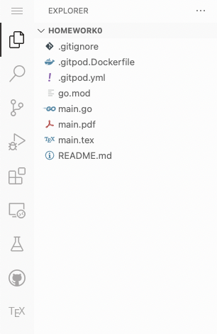
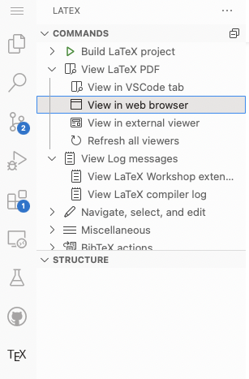

## Introduction to Cryptography 

Welcome to the Fall 2022 instance of CSCE 557/Math 587. This assignment is intended to 
familiarize you with tools used in this course.

- If you don't have an account at GitHub, sign up at https://github.com/join
If you sign up for a [student developer pack](https://education.github.com/benefits?type=student)
you get additional benefits.
- If you don't have an account at GitPod, sign up at [https://gitpod.io/login/](https://gitpod.io/login/)
Note you can use your GitHub account for authentication. 
- Send me your GitHub username. 
- Open https://gitpod.io/#https://github.com/UofSC-Fall-2022-Math-587-001/homework0
or click on the GitPod icon above. 
- Open `main.tex` in the side bar. 

- Click on the TeX icon > View Latex PDF > View in web browser and then click through the popup. This 
will open up the pdf in a separate tab/window. 

